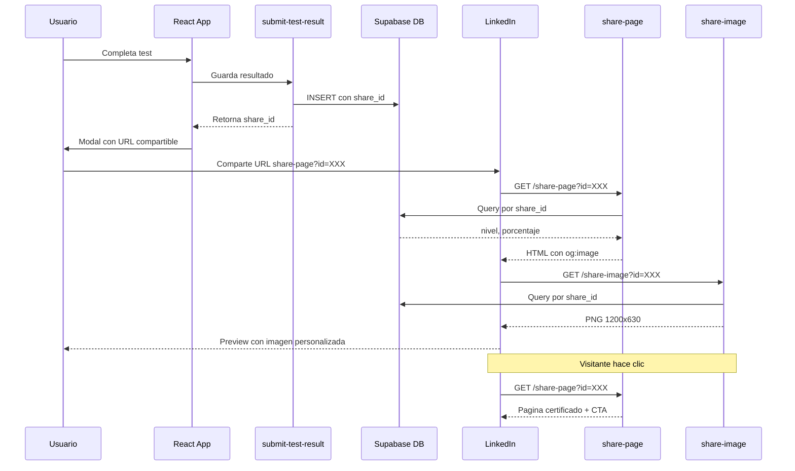

# PRD-05: Compartir Resultados en LinkedIn

## Metadata
- Version: 1.0
- Fecha creacion: 2026-01-02
- Estado: Por implementar

---

## 1. Objetivo

Sistema de compartir resultados del test de nivel en LinkedIn con:
- Open Graph tags dinamicos para preview personalizado
- Pagina publica de "certificado" 
- Loop viral con CTA "Haz tu propio test"

---

## 2. Problema

El flujo actual de compartir en LinkedIn tiene limitaciones:
1. La descarga de imagen no funciona bien en iOS Safari
2. LinkedIn abre el feed generico sin texto pre-rellenado
3. No hay OG tags dinamicos - el preview siempre muestra la imagen generica del sitio
4. No hay loop viral para atraer nuevos usuarios

---

## 3. Arquitectura

### Flujo del Usuario (existente - sin cambios)
```
Usuario completa test
    ↓
Se guarda en BD: id, anonymous_id, share_id
    ↓
URL navegador: /test-nivel?result=ID
    ↓
Si refresca → get-test-result valida anonymous_id → ve sus resultados
```

### Flujo de Compartir (nuevo)
```
Usuario hace clic "Compartir en LinkedIn"
    ↓
Modal muestra URL: /functions/v1/share-page?id=SHARE_ID
    ↓
Click "Ir a LinkedIn" → abre share intent con URL
    ↓
LinkedIn scraper accede a share-page
    ↓
Lee OG tags dinamicos (titulo, descripcion, imagen)
    ↓
Visitante ve post con preview personalizado
    ↓
Click → ve pagina certificado + CTA "Haz el tuyo"
```

### Diagrama de Secuencia



---

## 4. Componentes Tecnicos

### 4.1 Campo share_id en test_results

```sql
ALTER TABLE test_results 
ADD COLUMN share_id UUID DEFAULT gen_random_uuid() UNIQUE;

CREATE INDEX idx_test_results_share_id ON test_results(share_id);
```

**Proposito de los 3 IDs:**

| Campo | Proposito | Acceso |
|-------|-----------|--------|
| `id` | Identificador del registro | URL del navegador `?result=ID` |
| `anonymous_id` | Autenticacion del dueno | `get-test-result` valida coincidencia |
| `share_id` | Acceso publico limitado | `share-page` y `share-image` |

### 4.2 Edge Function: share-image

```
GET /functions/v1/share-image?id=SHARE_ID
Response: image/png (1200x630)
```

- Consulta `test_results` por `share_id`
- Genera imagen PNG con Canvas de Deno
- Muestra: nivel, porcentaje, branding
- Cache headers para optimizar rendimiento
- 404 si share_id no existe

### 4.3 Edge Function: share-page

```
GET /functions/v1/share-page?id=SHARE_ID
Response: text/html
```

HTML con OG tags dinamicos:
```html
<meta property="og:title" content="Soy nivel INTERMEDIO en Vibe Coding!" />
<meta property="og:description" content="Complete el test con 75% de aciertos" />
<meta property="og:image" content="https://xxx.supabase.co/functions/v1/share-image?id=XXX" />
<meta property="og:url" content="https://xxx.supabase.co/functions/v1/share-page?id=XXX" />
```

Contenido visual:
- Certificado/badge del resultado
- Nivel, porcentaje, fecha
- Branding Vibe Coders
- Boton CTA: "Haz tu propio test" → vibe-coders.es/test-nivel

---

## 5. Seguridad y Privacidad

### Datos Publicos (via share_id)
- nivel_resultado
- porcentaje (calculado de respuestas_correctas/preguntas_respondidas)
- tiempo_total_segundos
- created_at

### Datos Privados (requiere anonymous_id)
- respuestas_detalle
- anonymous_id
- idioma_navegador
- pais_inferido
- zona_horaria

### Politicas RLS

```sql
-- RLS habilitado en test_results
-- 
-- SELECT: SOLO service_role puede leer
--   - Las Edge Functions usan service_role key
--   - Usuarios anonimos NO pueden SELECT directo
--   - Edge Functions controlan que datos exponen
--
-- INSERT: Cualquiera puede insertar
--   - Necesario para flujo anonimo del test
--   - Rate limit validado en Edge Function
--
-- UPDATE: No permitido (sin politica)
-- DELETE: No permitido (sin politica)
```

---

## 6. Cambios en Frontend

### ShareLinkedInModal
- Recibir `shareId` como prop
- Construir URL compartible con share-page
- Boton "Compartir en LinkedIn" usa share intent
- Boton "Descargar imagen" como fallback

### TestNivel
- Guardar `share_id` del response
- Pasarlo al modal

### useCanvasShare (fix iOS)
- Detectar iOS/Safari
- Usar `navigator.share()` si disponible
- Fallback: abrir imagen en nueva pestana

---

## 7. Metricas de Exito

- Cantidad de share_id utilizados (accesos a share-page)
- Tasa de conversion: visitantes share-page → nuevos tests
- Compartidos en LinkedIn por test completado

---

## 8. Archivos Afectados

| Archivo | Accion |
|---------|--------|
| `supabase/migrations/xxx_add_share_id.sql` | Crear |
| `supabase/functions/share-image/index.ts` | Crear |
| `supabase/functions/share-page/index.ts` | Crear |
| `supabase/functions/submit-test-result/index.ts` | Modificar |
| `supabase/config.toml` | Modificar |
| `src/components/ShareLinkedInModal.tsx` | Modificar |
| `src/pages/TestNivel.tsx` | Modificar |
| `src/hooks/useCanvasShare.ts` | Modificar |

---

## Changelog

### v1.0 (2026-01-02)
- Documento inicial

