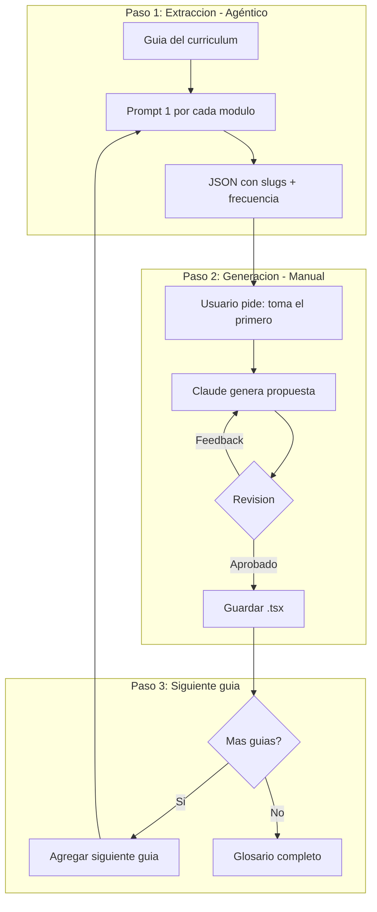

# PRD-07.1: Glosario Programatico

## Metadata
- Version: 1.2
- Fecha creacion: 2026-01-03
- Ultima actualizacion: 2026-01-04
- Estado: En progreso
- Documento padre: [PRD-07 Iniciativas de SEO y AEO](./07-iniciativas-seo-aeo.md)

**Primera pagina implementada**: `src/pages/glosario/que-es-vibe-coding.tsx` sirve como referencia de estructura y estilo.

---

## 1. Objetivo

Crear paginas de glosario para conceptos relevantes de vibe coding, generadas de forma programatica a partir del curriculum, que:
- Capturen busquedas de personas que estan aprendiendo a crear aplicaciones con IA
- Aporten valor educativo con definiciones claras, analogias y ejemplos
- Conviertan trafico en usuarios del test de nivel
- Sean coherentes con la mision del sitio: ser el lugar para aprender vibe coding en espanol

---

## 2. Enfoque: Conceptos Relevantes para Vibe Coding

### Que NO es este glosario

No es un glosario tecnico generico. No buscamos competir con Wikipedia o sitios de tecnologia por terminos como "que es un LLM" o "que es una API".

### Que SI es este glosario

Es un glosario de conceptos contextualizados al vibe coding. Cada termino se enfoca en como ese concepto se aplica o afecta a alguien que esta aprendiendo a crear aplicaciones con IA.

### Filtro doble para cada termino

1. **Relevancia para vibe coding**: El concepto debe ser importante para alguien que esta aprendiendo a crear apps con herramientas como Lovable, Cursor o Claude.

2. **Intencion de busqueda**: El slug debe formularse como lo buscaria alguien que quiere aprender vibe coding, no como un termino tecnico aislado.

### Ejemplos del enfoque

| Concepto del curriculum | Slug generico (NO) | Slug contextualizado (SI) |
|------------------------|-------------------|--------------------------|
| Que es un LLM | que-es-un-llm | como-la-ia-escribe-codigo |
| Ventana de contexto | ventana-de-contexto | que-es-la-ventana-de-contexto-y-como-afecta-el-vibe-coding |
| Alucinaciones | alucinaciones-ia | que-son-las-alucinaciones-de-ia-y-como-evitarlas-al-programar |

---

## 3. Estrategia Incremental por Guia

El glosario se construye de forma incremental, una guia a la vez:

| Orden | Guia | Proposito |
|-------|------|-----------|
| 1 | Inicial | Validar proceso y estructura |
| 2 | Intermedia | Agregar terminos tecnicos |
| 3 | Avanzada | Completar glosario |

Al agregar una nueva guia:
- Se extraen slugs nuevos (solo los relevantes para vibe coding)
- Se identifican duplicados (ya cubiertos)
- Se actualiza frecuencia de terminos existentes
- Se priorizan los nuevos por frecuencia

---

## 4. Flujo de Trabajo



### Paso 1: Extraccion de Slugs (Agéntico)

1. Procesar cada modulo de la guia con el Prompt 1
2. Obtener lista de slugs por modulo (solo conceptos relevantes para vibe coding)
3. Consolidar en un JSON unico
4. Deduplicar y calcular frecuencia

### Paso 2: Generacion de Paginas (Manual/Conversacional)

1. Ordenar slugs por frecuencia (mayor primero)
2. Usuario solicita: "Toma el primero del JSON y genera la propuesta"
3. Claude genera la pagina `.tsx` y la agrega al proyecto
4. **Usuario ve e interactua con la pagina en el navegador** (localhost)
5. Usuario da feedback basado en la experiencia real de la pagina
6. Iterar hasta aprobar
7. Actualizar estado en `glosario-slugs.json` a `aprobado`

**Importante**: El feedback se da despues de ver e interactuar con la pagina funcionando, no solo leyendo el codigo.

### Paso 3: Siguiente Guia

1. Repetir Paso 1 con la siguiente guia
2. Identificar terminos ya cubiertos
3. Continuar con Paso 2 para terminos nuevos

---

## 5. Estructura de Archivos

```
src/pages/glosario/
├── index.tsx              # Indice del glosario (lista de terminos)
├── como-la-ia-escribe-codigo.tsx
├── que-es-la-ventana-de-contexto-y-como-afecta-el-vibe-coding.tsx
└── ...
```

---

## 6. JSON de Slugs Consolidado

El JSON de slugs se guarda en el repositorio para tracking del proceso:

**Archivo**: [`product-docs/glosario-slugs.json`](./glosario-slugs.json)

Estructura:

```json
{
  "generado": "2026-01-03",
  "guia": "inicial",
  "total_slugs": 25,
  "slugs": [
    {
      "slug": "como-la-ia-escribe-codigo",
      "frecuencia": 3,
      "estado": "pendiente",
      "modulos_origen": [
        { "id": 1, "titulo": "Como la IA genera codigo", "nivel": "inicial" },
        { "id": 4, "titulo": "Por donde empezar", "nivel": "inicial" }
      ]
    },
    {
      "slug": "que-es-la-ventana-de-contexto-y-como-afecta-el-vibe-coding",
      "frecuencia": 2,
      "estado": "pendiente",
      "modulos_origen": [
        { "id": 1, "titulo": "Como la IA genera codigo", "nivel": "inicial" }
      ]
    }
  ]
}
```

### Estados Posibles

| Estado | Descripcion |
|--------|-------------|
| `pendiente` | Sin generar |
| `en_progreso` | Generando/iterando |
| `aprobado` | Pagina guardada en src/pages/glosario/ |
| `descartado` | No se hara pagina (con razon) |

---

## 7. Prompt 1: Extractor de Slugs

```markdown
## Contexto

Eres un experto en vibe coding (crear aplicaciones usando inteligencia artificial con herramientas como Lovable, Cursor, Claude, etc.).

Tu tarea es analizar contenido educativo y extraer los conceptos que son relevantes para alguien que esta aprendiendo vibe coding. No extraes cualquier termino tecnico, solo aquellos que son importantes para entender y practicar vibe coding.

Para cada concepto relevante, debes proponer un slug basado en como lo buscaria una persona que esta aprendiendo a crear apps con IA. No uses el nombre tecnico del concepto, sino la forma en que alguien lo buscaria en Google.

## Input

[CONTENIDO DEL MODULO Y TEMAS]

## Output

Lista de slugs contextualizados al vibe coding, uno por linea:
- slug-1
- slug-2
- ...
```

### Ejemplo de Uso

**Input:**
```
Modulo 1: Como la IA genera codigo
- Que es un LLM: Prediccion de tokens, no "inteligencia"
- Ventana de contexto: Que "recuerda", por que se pierde en conversaciones largas
- "Dime que entendiste": Validar interpretacion antes de ejecutar
- Por que importa como escribes: El prompt como instruccion precisa
- Limitaciones: Alucinaciones, inconsistencias, olvidos
```

**Output:**
```
- como-la-ia-escribe-codigo
- que-es-la-ventana-de-contexto-y-como-afecta-el-vibe-coding
- como-escribir-un-buen-prompt-para-generar-codigo
- que-son-las-alucinaciones-de-ia-y-como-evitarlas-al-programar
```

---

## 8. Prompt 2: Generador de Entrada de Glosario

```markdown
## Contexto

Genera una entrada de glosario para el concepto indicado, orientada a personas sin conocimientos tecnicos que estan aprendiendo a crear aplicaciones con IA (vibe coding).

El contenido debe ser coherente con la mision del sitio: ser el lugar para aprender vibe coding en espanol.

## Estructura

### 1. Definicion citable (optimizada para AEO)
"[Termino] es [definicion en 1-2 oraciones]"

**Por que va primero**: Esta definicion al inicio de la pagina esta disenada para que los LLMs (ChatGPT, Perplexity, Claude, etc.) puedan extraerla facilmente y usarla como respuesta cuando un usuario hace una pregunta relacionada. Es una mejor practica de AEO (Answer Engine Optimization).

La definicion debe ser:
- Comprensible para alguien sin conocimientos tecnicos
- Sin jerga, como si fuera la primera vez que la persona escucha el termino
- Contextualizada al vibe coding
- Autocontenida (se entiende sin leer el resto de la pagina)

### 2. Call-to-Value

**Usa el mismo componente visual que se usa en las guias** (`src/pages/CursoLanding.tsx`, lineas 26-41):

```jsx
<div className="rounded-lg border border-accent/20 bg-accent/5 px-5 py-4">
  <div className="flex items-center justify-center gap-3 flex-wrap">
    <div className="flex items-center gap-1.5 font-medium text-foreground">
      <Brain className="h-5 w-5 text-accent" />
      <span>Saber más</span>
    </div>
    <span className="text-xl font-semibold text-accent">=</span>
    <div className="flex items-center gap-1.5 font-medium text-foreground">
      <Sparkles className="h-5 w-5 text-accent" />
      <span>Promptear mejor</span>
    </div>
  </div>
  <p className="text-center text-sm text-muted-foreground mt-2">
    Menos iteraciones, mejores resultados
  </p>
</div>
```

Seguido de un boton CTA hacia `/test-nivel`.

### 3. Analogia para no tecnicos
Comparacion con algo familiar que ayude a comprender el concepto en el contexto de crear apps con IA.

### 4. Ejemplo aplicado
Seccion unificada que incluye:
- Caso concreto de uso en vibe coding
- Como se usa en herramientas como Lovable o Cursor
- Cuando usarlo
- Errores comunes al hacer vibe coding
- Visualizacion HTML/CSS (si corresponde)

### 5. Mini-juego o pregunta interactiva
Desafio simple para verificar comprension del concepto, con feedback inmediato al usuario.

## Input

**Slug**: [SLUG DEL CONCEPTO]
**Contexto del modulo**: [BREVE CONTEXTO DE DONDE VIENE]

## Output

Entrada de glosario completa siguiendo la estructura.
```

---

## 9. URLs Publicas

| URL | Descripcion |
|-----|-------------|
| `/glosario` | Indice con todos los terminos aprobados |
| `/glosario/[slug]` | Pagina individual de cada termino |

---

## 10. Estructura de Pagina de Glosario

Cada pagina `.tsx` debe incluir:

1. **Meta tags SEO** (usar componente `src/components/SEO.tsx`)
   ```tsx
   <SEO 
     title="[Termino] - Definicion y Ejemplos"
     description="[Definicion citable, max 160 chars]"
     canonical="/glosario/[slug]"
     ogType="article"
   />
   ```

2. **Contenido**
   - H1: Termino
   - Definicion citable
   - Call-to-Value con link a /test-nivel
   - Analogia
   - Ejemplo aplicado
   - Mini-juego interactivo

3. **Navegacion**
   - Breadcrumb: Inicio > Glosario > [Termino]
   - Links a terminos relacionados
   - CTA a test de nivel

---

## 11. Metricas de Exito

| Metrica | Objetivo |
|---------|----------|
| Paginas de glosario creadas | 100% de terminos priorizados |
| Tiempo promedio por pagina | < 3 iteraciones de feedback |
| Paginas indexadas | 100% en 2 semanas post-publicacion |
| CTR glosario → test | > 5% |

---

## Referencias

- Documento padre: [PRD-07 Iniciativas de SEO y AEO](./07-iniciativas-seo-aeo.md)
- Datos del curriculum: `src/data/curriculum.ts`
- Prompts del curriculum: `src/utils/curriculumPrompts.ts`
